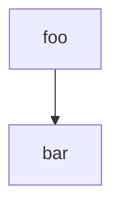

# opencoin version 4

This is where we develop version 4 of the opencoin protocol. It is going to be a protocol
only. This means to sample clients, just enough python code to generate the working examples
needed for the documentation.

