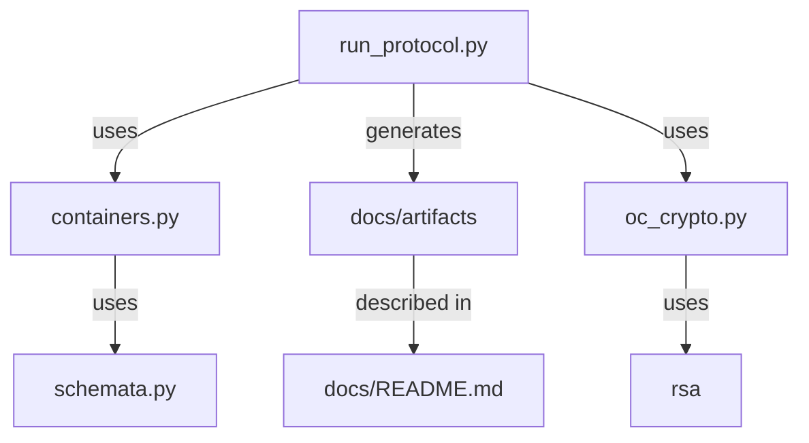

# opencoin version 4

This is where we develop version 4 of the opencoin protocol. It is going to be a protocol
only. This means to sample clients, just enough python code to generate the working examples
needed for the documentation.

## What is what?

`run_protocol.py` is the main file, that generates the examples in the `docs/artifacts` directory. These files have a suffix
of `.oc`, as in OpenCoin, but really are just json files. It uses `oc_crypto.py`, which is a minimalistic layer 
on top of the [`python-rsa`](https://pypi.org/project/rsa/) package - we don't want to implement our own crypto.
Having said that, there are some small helper functions to help with the blinding.

`schemata.py` contains the actual schemata for the different opencoin messages, using 
[marshmallow](https://marshmallow.readthedocs.io) to describe them.

`containers.py` uses `schemata.py`, and are the python classes that are used in the protocol. 

[`docs/README.md`](docs/README.md) is the main documentation document at the moment.

## Conventions

- BigInts are represented as hex, but used as numbers internally
- Hashes are used as bigints (we sign the number, not the string representation of them)
- For container signing we use pkcs-1 signing of the json documents which are indented by 2 spaces
- The exception for the moment are the coins, where we (blind) sign directly the hashes of the blinds
