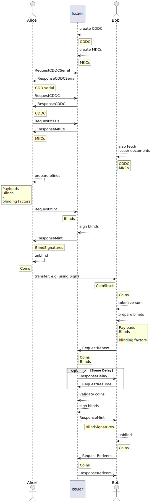

# OpenCoin protocol

## Assumptions

The exchange of messages MUST happen over a **secure channel**. For HTTPS this means [TLS](https://de.wikipedia.org/wiki/Transport_Layer_Security), but other channels like messengers provide their own. For an email exchange [GPG](https://www.gnupg.org/) would be recommended. Either way, it is the responsibility of the developer to take care of the transport security.

When requesting the issuer to mint or redeem coins some form of **authentication & authorization** is most likely required - the issuer needs to secure payment for the coins, or make a payment somewhere for redeemed coins. Because auth* might already be provided by the transport layer, we don't include it in the OpenCoin protocol.

## Sequence diagram

The following diagram shows the flow of messages (and actions):

:::{figure-md} sequence-diagram
:class: figure

OpenCoin sequence diagram
:::

## Protocol description

This is a description of the actual steps. Additional info for individual steps can also be found 
in the respective sections in  [Schemata](schemata). [^side]

[^side]: We find it easier to follow along with the above diagram open in a second window (or printout).

### Participants

**Issuer** can mint, refresh and redeem coins. This entity will probably an account handling system (a.k.a. bank) behind it for doing actual real-world payments. The issuer is trusted to handle coins and payments correctly, but is *not trusted* regarding privacy - the target of OpenCoin is to protect the privacy of the transfers.

**Alice** and **Bob** are clients using OpenCoin. Technically they are software clients, and they represent the *users* of the system.[^diag] They need to be known by the customer in order to mint or redeem coins. Authentication could be required to renew coin. This would allow a "closed" system, in which accounts of the users could be monitored.

### Steps in the protocol

#### create CDDC

The issuer creates a pair of cryptographic keys (the currency keys), and signs a *Currency Description Document Certificate* ([CDDC](schemata.md#cddc)) with its secret key. This contains information about the currency, like denominations, urls but also the  public key. This is the top document which establishes the trust in all other elements.

Not mentioned in the CDDC but probably somewhere on the issuer website is the relation between opencoins and actual real-world money. Let's say the currency of an example issuer is called "opencent".[^cent] The rule might be that one opencent is given out for one EUR cent, and redeemed for one EUR cent, effectively binding the opencent to the EUR.

#### create MKCs

For each denomination in the currency separate minting keys are generated, and a *Mint Key Certificate* ([MKC](schemata.md#MKC)) for them as well. Those MKCs are signed the secret currency key. The mint keys are only valid for a defined period of time.[^comp]

#### RequestCDDCSerial

[RequestCDDCSerial](schemata.md#requestcddserial-message) asks for the current serial number of the CDDC. The currency description could change over time, maybe because urls have changed. Every time a new CDDC is created, with a new, increasing serial number. The clients need to make sure to always use the most current CDDC, but they can cache it, allowing them to skip the next step.

#### ResponseCDDCSerial

[ResponseCDDSerial](schemata.md#responsecddserial-message) contains the current serial of the [CDDC](schemata.md#CDDC).

#### RequestCDDC

[RequestCDDC](schemata.md#requestcddc-message) asks for a [CDDC](schemata.md#CDDC). If no serial is provided, the message asks for the most current CDDC.

#### ResponseCDDC

[ResponseCDDC](schemata.md#responsecddc-message) contains the [CDDC](schemata.md#CDDC)

#### RequestMKCs

[RequestMKCs](schemata.md#requestmkcs-message) asks for the [Mint Key Certificates](schemata.md#mkc). The client can specify specific denominations or *mint key ids*. An unspecified request will return all current MKCs.

#### ResponseMKCs

[ResponseMCKs](schemata.md#responsemkcs-message) contains the [MKCs](schemata.md#mkc)

#### prepare blinds

This step prepares a coin. In essence this is a [Payload](schemata.md#payload) with a serial number, which is later on signed by the issuer using a denomination specific mint key. The "envelope" [mentioned above](overview.md#how-does-it-work) really means that the serial is blinded using a separate random secret **blinding factor** for each serial number. This factor is needed later on to "open up the envelope", reversing the blinding operation. Hence, the client has to store the blinding factor for later on. As the blinding factor is individual for each serial number, a reference number is created to reference serial, blinding factor and [Blind](schemata.md#blind).

The blinds contain the reference, the blind to be signed, and the mint key id for the denomination or value of the coin.

#### RequestMint

[RequestMint](schemata.md#requestmint-message) hands in the [Blinds](schemata.md#blind) created in the step before, asking for the blind to be signed.

Most likely the issuer has authenticated the client. The mint key id tells the issuer what denomination to use for the signing operation. This will allow the issuer to deduct a payment for the minting operation (outside OpenCoin).

The message also carries a transaction_reference (a random number), in case there is a delay in the minting process. The client can then later on ask again for the signatures to be delivered using the same transaction_reference.

#### sign blinds

The issuer uses the secret minting key for the desired operation to sign the [Blind](schemata.md#blind), creating [Blind Signatures](schemata.md#blindsignature).

#### ResponseMint

[ResponseMint](schemata.md#responsemint-message) contains the [Blind Signatures](schemata.md#blindsignature) for the [Blinds](schemata.md#blind).

#### unblind

The client will unblind the [Blind Signature](schemata.md#blindsignature) using the before stored secret blinding factor. This gives the client the signature for the serial number, and both together give the [Coin](schemata.md#coin).

#### CoinStack

When sending coins multiple coins can be combined into a [CoinStack](schemata.md#coinstack-message). This CoinStack can also have a "subject", maybe containing an order reference - the reason the CoinStack is handed over in the first place.

The transfer of the CoinStack is out of scope of the OpenCoin protocol. We imagine multiple ways: using a messenger like Signal, using email or using the Browser. A CoinStack can also be encoded using a QR code, and maybe printed out and sent using normal postal mail.

Anyhow, the point of this step is that Alice transfers a CoinStack to Bob. And because she is a fair user, she will delete all coins that were contained in the CoinStack on her side.

#### tokenize

[Coins](schemata.md#coin) that are received need to be swapped for new ones, in order to protect the receiver against double spending. Bob needs to decide which new coins he wants to have, and tokenize amount in the right way to have a good selection of future coin sizes. [^tokenize]

#### prepare blinds

Knowing the right coin selection from the step before Bob prepares [Blinds](schemata.md#blind) the same way Alice has done with hers, creating [Payloads](schemata.md#payload) (containing serials), and storing the blinding secrets under a reference.

#### RequestRenew

The renewal process is effectively the same as in minting new coins, but it is paid for in opencoins, instead of making a payment in the background using accounts. Hence, the [RequestRenew](schemata.md#requestrenew-message) message needs to contain [Coins](schemata.md#coin) that have a value that matches the sum of value of the [Blinds](schemata.md#blind). The message also contains a transaction_reference in case a delay happens.

#### ResponseDelay

This step is optional.

If something takes a while at the issuer when signing the blinds, either while handling a [RequestMint](schemata.md#requestmint-message) or [RequestRenew](schemata.md#requestrenew-message) a [ResponseDelay](schemata.md#responsedelay-message) can be sent back to indicate that the client should try again sometime later. This allows the network connection be closed in the meantime. Hopefully operations resume in a short time.

Delays should be avoided on the issuer side.

#### RequestResume

Bob will try a suitable amount of time later on to resume the transaction (the renewal in this case). The [RequestResume](schemata.md#requestresume-message) message will send over the transaction reference, and the issuer will hopefully respond with a [ResponseMint ](schemata.md#responsemint-message) message, or with another [ResponseDelay](schemata.md#responsedelay-message).

#### validate coins

Bob validates the [Coins](schemata.md#coin), just as Alice did.

#### RequestRedeem

Bob might want to swap some or all of the [Coins](schemata.md#coin) he holds for real-world currency at the issuer. He sends in the coins in a [RequestRedeem](schemata.md#requestredeem-message) message. This effectively takes the coins out of circulation, and the issuer will make a payment to Bob's account. This requires the client to be authenticated for this step, which again is outside the OpenCoin protocol.

#### ResponseRedeem

The issuer confirms that everything went ok using the [ResponseRedeem](schemata.md#responseredeem-message) message.

[^diag]: To keep the diagram simple we have left out Charlene who was mentioned above in "[How does it work?](overview.md#how-does-it-work)". Bob does everything she does.

[^cent]: "opencent" refers to the specific example currency. The generic term "opencoin" refers to any currency following the OpenCoin protocol (of which opencent is one).

[^comp]: This is to minimize damage in case the mint keys get compromised.

[^tokenize]: It might be that also some existing coins might be needed to be swapped to get a good coin selection. See [RequestRenew Message](schemata.md#requestrenew-message).
