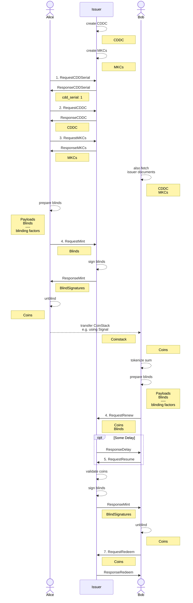

```mermaid
sequenceDiagram
actor alice as Alice
participant issuer as Issuer
actor bob as Bob

issuer -->> issuer: create CDDC
note right of issuer: CDDC
issuer -->> issuer: create MKCs
note right of issuer: MKCs


alice->>issuer: 1. RequestCDDSerial
issuer->>alice: ResponseCDDSerial
note right of alice: cdd_serial: 1

alice->>issuer: 2. RequestCDDC
issuer->>alice:  ResponseCDDC
note right of alice: CDDC

alice->>issuer: 3. RequestMKCs
issuer->>alice: ResponseMKCs
note right of alice: MKCs

bob-->>bob: also fetch<br> issuer documents
note right of bob: CDDC<br>MKCs

alice -->> alice: prepare blinds 
note left of alice: Payloads<br>Blinds<br>----<br>blinding factors

alice ->> issuer: 4. RequestMint
note left of issuer: Blinds

issuer -->> issuer: sign blinds

issuer ->> alice: ResponseMint
note right of alice: BlindSignatures

alice -->> alice: unblind
note left of alice: Coins

alice -->> bob: transfer CoinStack<br>e.g. using Signal
note left of bob: Coinstack
note right of bob: Coins

bob -->> bob: tokenize sum

bob -->> bob: prepare blinds
note right of bob: Payloads<br>Blinds<br>----<br>blinding factors

bob ->> issuer: 4. RequestRenew
note right of issuer: Coins<br>Blinds

opt Some Delay
    issuer ->> bob: ResponseDelay
    bob ->> issuer: 5. RequestResume
end

issuer-->>issuer: validate coins
issuer -->> issuer: sign blinds
issuer ->> bob: ResponseMint
note left of bob: BlindSignatures

bob -->> bob: unblind
note right of bob: Coins

bob ->> issuer: 7. RequestRedeem
note right of issuer: Coins
issuer->>bob: ResponseRedeem


```