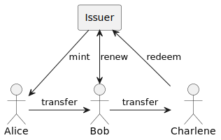

# Overview

We propose a protocol that allows cash-like payments in the electronic world. It is based on the invention by David Chaum[^chaum82]. The main focus are *untraceable* payments, which means that even though there is a central entity (called the issuer, something like a bank), this central entity can't see the transactions happening. This is good for the privacy of the users.

The focus of the project is the protocol. This means we standardize the way we exchange messages and their content in order to make electronic cash payments. But we don't deliver an implementation here. That is the scope of other project(s). OpenCoin is the foundation to build upon.

## How does it work?

:::{figure-md} overview-diagram
:class: figure

Simplified overview of the OpenCoin flow.
:::

This is a high level (but strongly simplified) image describing the basic system. We have three participants: Alice and Bob are normal users, while the Issuer is something like a bank, capable of minting coins. It also acts as an exchange for 'real-world' currency. At this high level it works as follows:

1. Alice asks the Issuer to **mint** coins. This is done in a special way using *blind signatures*, which means that the coins *can't be linked to her* later on.
2. Alice then **transfers** the coins to Bob. She can do that any way she wants, e.g. using WhatsApp, Email or any other system of her choice (also depending on what her client software supports). This could even be done by printing the coins and handing them over.
3. Bob then **renews** the coins. He swaps the coins he got from Alice for fresh coins. This way he protects himself against Alice "accidentally"  using the coins somewhere else. One can spend opencoins only once, so *double spending* needs to be ruled out, and this is done by immediately renewing received coins.
4. Bob might **transfer** the coins to yet another person, Charlene
5. Charlene decides to **redeem** the coins, meaning she asks the issuer to swap the opencoins for real-world money.

On **blind signatures**: at the core a coin is a serial number with a signature from the mint. In order to ensure that *a coin can't be traced back to the original client* we use blind signatures.
Imagine Bob hands in a coin that Alice had minted. In order to ensure the coin can't be traced back to Alice, the  issuer has to sign the serial number without seeing it. In non-technical terms Alice puts the serial number in an envelope (along with carbon copy paper), and the issuer actually signs the envelope. Because of the carbon copy paper the signature presses through onto the serial number. Alice can then open up the envelope and has a signed serial, without the issuer ever seeing it.

## Who is it for?

OpenCoin (the protocol) allows the development of applications for electronic cash. So firstly OpenCoin is targeted at developers. These applications however should allow everyone to make and receive electronic payments. It still requires somebody to run the central issuer. This issuer would issue an OpenCoin based electronic money system. Because electronic money is quite regulated in Europe (and other countries), the issuer would be most likely a regulated electronic money provider or a bank. We think, that a central bank would be the best issuer, because central banks issue money anyhow. But nothing technical stops you from using OpenCoin for your private project [^law].

## Alternatives

Why don't just use one of the alternatives?

### Bitcoin / blockchain

Bitcoin (or blockchain in the more general form) is basically the opposite of OpenCoin: transfers have to happen within the system, they are visible to everybody, there is no central instance, there is no guaranteed value you can redeem the bitcoins for.

OpenCoin on the contrary makes the transfers invisible and untraceable, and has a central instance that is able to guarantee a value if you redeem the OpenCoin.

So, bitcoin is something is not a real alternative, more the chainsmoking insane relative :-)

### GNU Taler

[GNU Taler](https://taler.net) is build around the same central idea as OpenCoin. It started later, and is more complete than OpenCoin. They differ in the way the take care of the [renewal step](schemata.md#requestrenew-message) and coin splitting. They also make more assumptions regarding the clients (e.g. clients having keys identifying them, which effectively requires the role-out of a whole PKI infrastructure), they have clearer roles (e.g. consumer and merchant) and by all of this hope to get around the inherent problems of untraceable transfers, e.g. tax-ability.

The trade-off seems to be that their system is harder is more complex and harder to understand. We also doubt that these complexities are necessary to reach the stated goals. We also doubt that the goals can really be reached, and also find that the system's documentation is quite hard to understand. This might be because they deliver implementations for all necessary software components, and are not really targeted at other implementations of they system.

[^chaum82]: David Chaum, “Blind signatures for untraceable payments”, Advances in Cryptology - Crypto ‘82, Springer-Verlag (1983), 199-203.

[^law]: Please check with your lawyer if this is a good idea.

